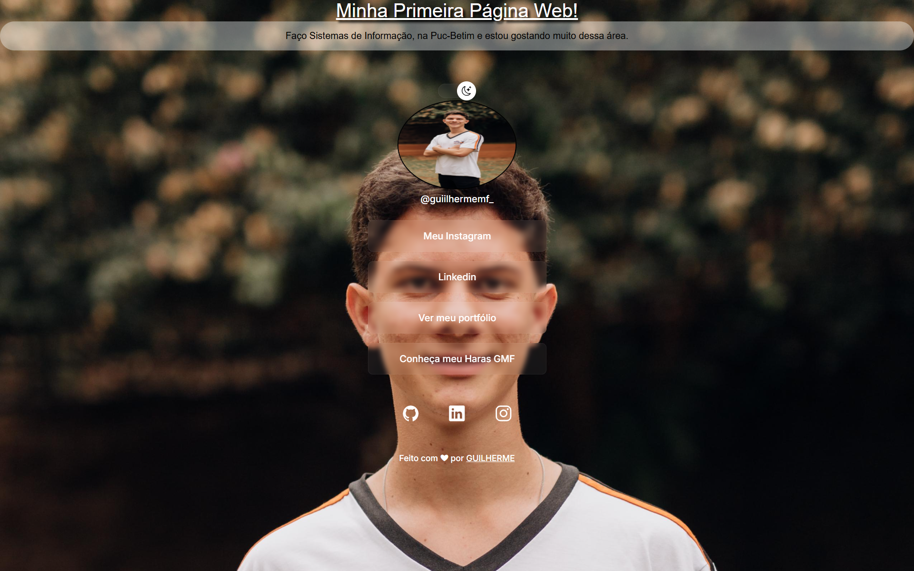

# Meu Projeto Web 🌐

> Guilherme Ferreira

Projeto desenvolvido durante meus estudos em Sistemas de Informação na PUC Minas - Betim e o curso rocketseat para ensino de texnologia web. 

🔗 [Clique aqui para acessar](https://guilhermemarquesf.github.io/projeto-completo/)

---

## 🚀 Tecnologias

- HTML
- CSS
- JavaScript
- Git e GitHub
- Figma

---

## 💻 Projeto

Este projeto é uma página web pessoal com:
- Foto de perfil
- Links para redes sociais
- Modo claro/escuro
- Interface inspirada no NLW Explorer

---

## 📸 Preview

---

## 📬 Contato

- Instagram: https://www.instagram.com/guiilhermemf_/
- LinkedIn: https://www.linkedin.com/in/guilherme-ferreira-6090403b5/
- GitHub: https://github.com/Guilhermemarquesf